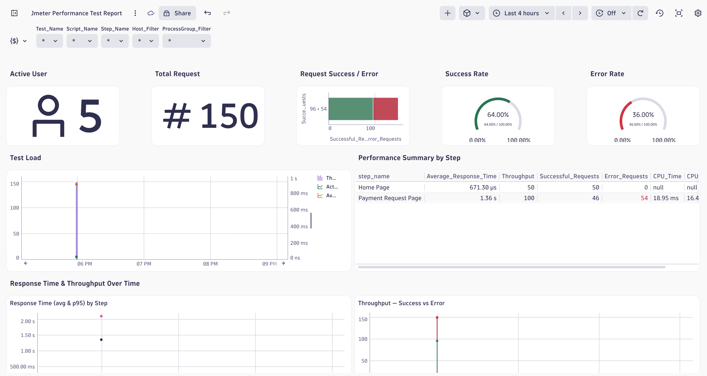
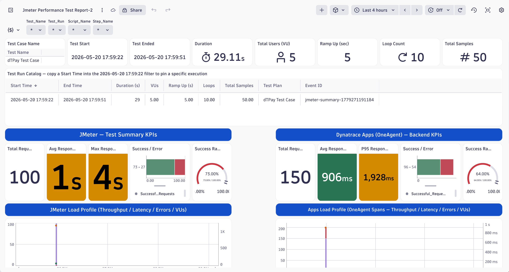
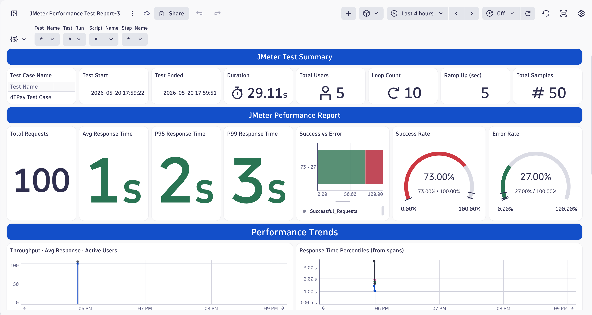

# Dynatrace — JMeter Performance Test Integration

End-to-end guide for integrating **Apache JMeter** with **Dynatrace** so that every load test run is fully observable inside Dynatrace — both from the **application side** (transactions, services, hosts monitored by the OneAgent) and from the **load generator side** (JMeter's own performance summary).

This integration produces:

1. **Per-request tagging** of every JMeter sample with load-test metadata (test name, script, step, virtual user) — surfaced in Dynatrace as **Request Attributes** on every distributed trace.
2. **A `TEST_START` BizEvent** when the test begins.
3. **A `TEST_SUMMARY` BizEvent** when the test ends, containing the full JMeter Summary Report (per-sampler and aggregated TOTAL row).

Three ready-to-import dashboards then correlate this data so that you can compare what the JMeter client measured against what Dynatrace observed inside the application.

---

## Table of Contents

1. [Architecture](#1-architecture)
2. [Prerequisites](#2-prerequisites)
3. [Step 1 — Configure Dynatrace](#step-1--configure-dynatrace)
4. [Step 2 — Open & Configure the JMeter Test Plan](#step-2--open--configure-the-jmeter-test-plan)
5. [Step 3 — Understand the JMeter Test Plan Structure](#step-3--understand-the-jmeter-test-plan-structure)
6. [Step 4 — Run the Test](#step-4--run-the-test)
7. [Step 5 — Import the Dynatrace Dashboards](#step-5--import-the-dynatrace-dashboards)
8. [Dashboards Explained](#dashboards-explained)

---

## 1. Architecture

```
        ┌──────────────────────┐         x-dynatrace-test header           ┌────────────────────────┐
        │       JMeter         │ ────────────────────────────────────────▶ │  Application under test │
        │  (Load Generator)    │           (LTN, LSN, TSN, VU, RUN)        │   + Dynatrace OneAgent  │
        │                      │                                            └────────────┬───────────┘
        │  setUp  → BizEvent   │                                                         │ spans
        │  Main   → HTTP samp  │                                                         ▼
        │  tearDn → BizEvent   │ ──── BizEvents API (/api/v2/bizevents/ingest) ──▶  Dynatrace SaaS
        └──────────────────────┘                                                         │
                                                                                          ▼
                                                                          ┌──────────────────────────┐
                                                                          │  Dashboards (3 views)    │
                                                                          │  1. Application view     │
                                                                          │  2. Comparison view      │
                                                                          │  3. JMeter summary view  │
                                                                          └──────────────────────────┘
```

Two independent data streams reach Dynatrace:

| Stream | Source | Captured as | Used by |
|---|---|---|---|
| HTTP request tagging | `x-dynatrace-test` header on every HTTP sampler | **Request Attributes** on spans | Dashboard 1, Dashboard 2 |
| BizEvents (start & summary) | `setUp` + `tearDown` JSR223 samplers | **BizEvents** (`com.jmeter.test.start`, `com.jmeter.test.summary`) | Dashboard 2, Dashboard 3 |

---

## 2. Prerequisites

* **Apache JMeter 5.6.x** (or later) — the plan uses Groovy (`JSR223`) and standard HTTP samplers.
* **A Dynatrace SaaS tenant** with:
  * **OneAgent** installed on the host(s) where the application under test runs.
  * Permissions to create **API tokens**, **Request Attributes**, and **Dashboards**.
* Network connectivity from the JMeter host to your Dynatrace SaaS environment (`https://<env>.live.dynatrace.com`).

---

## Step 1 — Configure Dynatrace

### 1.1 Create an API token

The JMeter `setUp` and `tearDown` scripts push BizEvents through the Dynatrace API.

1. In Dynatrace, open **Access Tokens** → **Generate new token**.
2. Name it e.g. `jmeter-bizevents-ingest`.
3. Grant the scope:
   * **`bizevents.ingest`** — *Ingest bizevents*
4. **Copy the token value** — you will paste it into the JMeter test plan in Step 2.

> The token must start with `dt0c01.…`. Store it as a secret; never commit it.

### 1.2 Create Request Attributes from the `x-dynatrace-test` header

Every HTTP request sent by JMeter carries an `x-dynatrace-test` header in the format:

```
LTN=<TestPlanTitle>;LSN=<ThreadGroupName>;TSN=<SamplerName>;VU=<ThreadNum>;RUN=<EpochMillis>
```

These tokens are the standard Dynatrace **Load Test Naming** convention. They are not parsed automatically — you must define **Request Attributes** so Dynatrace extracts them from the header and attaches them to every span.

In Dynatrace, go to **Settings → Server-side service monitoring → Request attributes** and create the following five attributes. For each one, use *Data source* = **HTTP request header** and *Source* = `x-dynatrace-test`, then add a **further processing** rule of type *Take the segment of a string between two delimiters*.

| Request Attribute name | Header | Between delimiters |
|---|---|---|
| `Load.Test.Name` | `LTN` | `LTN=` … `;` |
| `Load.Script.Name` | `LSN` | `LSN=` … `;` |
| `Test.Step.Name` | `TSN` | `TSN=` … `;` |
| `Test.Virtual.User` | `VU` | `VU=` … `;` |
| `Test.Run.Id` | `RUN` | `RID=` … *(end of string)* |

Make sure each Request Attribute is **enabled** for all relevant services (or globally).

> The dashboard queries reference these attribute names exactly (`request_attribute.Load.Test.Name`, etc.). If you rename them, edit the dashboard queries accordingly.

---

## Step 2 — Open & Configure the JMeter Test Plan

1. Open [dTJMeterPerfTestSample.jmx](dTJMeterPerfTestSample.jmx) in the JMeter GUI.
2. Select the root **Test Plan** node and edit the *User Defined Variables*:

   | Variable | Set to |
   |---|---|
   | `TEST_PLAN_TITLE` | A unique name for this test run (e.g. `dTPay-Checkout-Smoke-2026-05-20`) |
   | `DT_URL` | Your Dynatrace base URL, e.g. `https://abc12345.live.dynatrace.com` |
   | `DT_TOKEN` | The API token created in Step 1.1 |

3. Rename the main **Thread Group** (currently `Script Name Defind Here`) to a meaningful script name — this value is propagated into both the `x-dynatrace-test` header (as `LSN`) and the BizEvent payload as `test.script.name`.
4. Replace the two demo HTTP samplers (`Sample Home Page`, `Sample Post Request Page`) with the actual HTTP requests for your application. **Do not remove the `HTTP Header Manager`** — it is what tags every request for Dynatrace.
5. Adjust *Number of Threads*, *Ramp-up*, and *Loop Count* on the main Thread Group to match your test scenario.

---

## Step 3 — Understand the JMeter Test Plan Structure

The plan is intentionally split into three Thread Groups so that BizEvent boundaries are clean and statistics accumulate only over the real test workload.

```
Test Plan
│
├── setUp Thread Group
│   └── JSR223 Sampler → "DT BizEvent - Test Start Time"
│
├── Main Thread Group
│   ├── HTTP Header Manager (x-dynatrace-test)
│   ├── HTTP Request - GET /sample/page/api/to/test
│   └── JSR223 Listener → "Live Stats Accumulator for DT"
│
└── tearDown Thread Group
    └── JSR223 Sampler → "DT BizEvent - Test Summary Report"
```

### 3.1 HTTP Header Manager — request tagging

Attached to the main Thread Group, the `HTTP Header Manager` injects the **`x-dynatrace-test`** header (and a few diagnostic `X-JMeter-*` headers) into every outbound request:

```
x-dynatrace-test: LTN=${TEST_PLAN_TITLE};LSN=${__threadGroupName()};TSN=${__samplerName};VU=${__threadNum};RID=${__time()}
```

This is what causes each span on the application side to carry the Request Attributes you configured in Step 1.2. Dashboard 1 and the application-side panels of Dashboard 2 are built entirely on these attributes.

### 3.2 `setUp Thread Group` — `JSR223 Sampler` (test start)

Runs once before the main load. It:

* Initialises a shared `ConcurrentHashMap` in JMeter properties (`STATS_MAP`) used by the listener to aggregate per-sampler metrics.
* Records `TEST_START_EPOCH`, `TEST_START_TIME`, `TEST_PLAN_NAME` in JMeter properties.
* Sends a **`com.jmeter.test.start`** BizEvent to `POST {DT_URL}/api/v2/bizevents/ingest` containing the test plan name and start timestamp.

A `202` response confirms ingestion.

### 3.3 Main `Thread Group` — `JSR223 Listener` (per-sample aggregation)

Attached at the Thread Group level so it sees every sample result. For each sample (excluding the BizEvent samplers themselves) it updates the shared `STATS_MAP` with:

* count, error count
* sum and sum-of-squares of response time (for stddev)
* min / max response time
* bytes received / sent

On the first sample it also captures Thread Group configuration (threads, ramp-up, loop count, name) into properties so the `tearDown` can include them in the summary.

> All updates happen inside a `synchronized(lock)` block — safe under concurrent virtual users.

### 3.4 `tearDown Thread Group` — `JSR223 Sampler` (test summary)

Runs once after the main load completes. It:

1. Reads back the aggregated `STATS_MAP`.
2. Computes per-sampler **average / min / max / stddev / error % / throughput / KB/s** — the same columns as JMeter's built-in Summary Report.
3. Adds an aggregate **`TOTAL`** row.
4. Sends a **`com.jmeter.test.summary`** BizEvent to `/api/v2/bizevents/ingest` containing the entire summary table under `data.summary.rows`, plus test metadata (plan name, script name, start/end times, duration, threads, ramp-up, loops).

This is the single source of truth for Dashboard 3 and the JMeter-side columns of Dashboard 2.

---

## Step 4 — Run the Test

From the JMeter GUI:

* **File → Save**, then **Run → Start** (or use the green ▶ button).

From the CLI (recommended for real load runs):

```bash
jmeter -n -t dTJMeterPerfTestSample.jmx -l results.jtl -e -o ./html-report
```

Watch the JMeter log file or console output for the markers:

```
=== setUp: Fresh map created. Test Start = ...
=== DT BizEvent START → HTTP 202: ...
...
=== tearDown: Script started ===
=== DT BizEvent SUMMARY → HTTP 202: ...
```

A `202` response from Dynatrace on both BizEvent calls confirms successful ingestion.

---

## Step 5 — Import the Dynatrace Dashboards

For each JSON file in [dashboards/](dashboards/):

1. In Dynatrace, open **Dashboards** (the Dashboards app).
2. Click **+ → Upload** (or **Import dashboard**).
3. Select the JSON file and confirm.
4. Open the dashboard and choose your test run from the **`Test_Name`** variable filter at the top.

> The dashboards use variable defaults — set the timeframe to cover your test run and pick your `TEST_PLAN_TITLE` from the `Test_Name` dropdown.

---

## Dashboards Explained

### Dashboard 1 — Application Performance View



Source: **spans** captured by the Dynatrace OneAgent, filtered via the Request Attributes (`Load.Test.Name`, `Load.Script.Name`, `Test.Step.Name`, `Test.Virtual.User`).

Shows the test from the **application's perspective**: how the monitored services responded while under JMeter load. Includes Active Users, Total Requests, Success/Error counts and rate, response time and throughput over time, per-step breakdown, top services & hosts, and host/process CPU & memory consumption.

Use this dashboard when you want to know **what the application actually did** during the test.

### Dashboard 2 — JMeter vs. Application Comparison



Source: **BizEvents** (JMeter side) **and spans** (application side), shown side-by-side for the same test run.

For each step you can compare client-measured metrics (response time, throughput, errors as reported by JMeter) against server-measured metrics (span duration, request count, error responses as observed by the OneAgent). Divergence between the two columns typically points to network latency, client-side load generator saturation, or sampling/timing differences.

Use this dashboard to validate that the load actually arrived and to identify where time is being spent (client, network, or server).

### Dashboard 3 — JMeter Performance Test Report



Source: the single **`com.jmeter.test.summary`** BizEvent emitted by the `tearDown` script.

A pure JMeter view — the same information JMeter's built-in HTML report would show (per-sampler average / min / max / stddev / error % / TPS / throughput in KB/s, plus the aggregate `TOTAL` row), but stored centrally in Dynatrace and queryable across many test runs.

Use this dashboard for trend analysis, run-to-run comparison, and as a permanent archive of JMeter results.

### Additional AppEngine Performance Report

Source: pulling out the same source of data to the dashboard 1 and 2, put it into single apps with 3 tabs. Live performance (similar to dashboard 2) and Jmeter views and Dynatrace Views.

For each steps and metricses mentioned on previous dashboard are combined into this Apps, different presentation of data, Get more details of Apps and .

Use this dashboard for trend analysis, run-to-run comparison, and as a permanent archive of JMeter results.

---

## Notes

* The `x-dynatrace-test` header convention (`LTN`, `LSN`, `TSN`, `VU`, `RUN`) is the same one used by Dynatrace's official load-testing integrations — once configured, any compatible load tool (JMeter, NeoLoad, LoadRunner, k6 with a custom header) will populate the same Request Attributes and feed the same dashboards.
* The two BizEvent types (`com.jmeter.test.start`, `com.jmeter.test.summary`) are not Dynatrace built-ins — they are emitted by the JSR223 scripts in this plan and consumed by the dashboards. If you need additional fields, extend the `data` object in the `tearDown` script and add corresponding DQL fields to the dashboard tiles.
